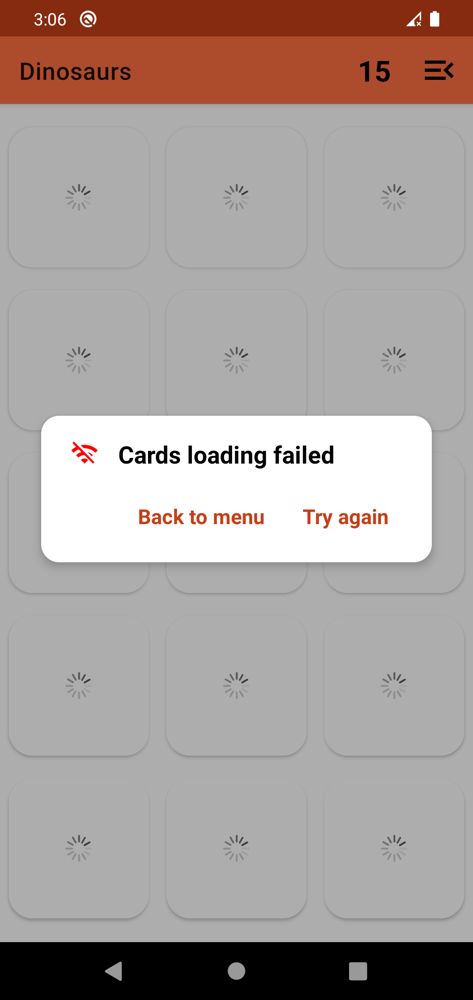
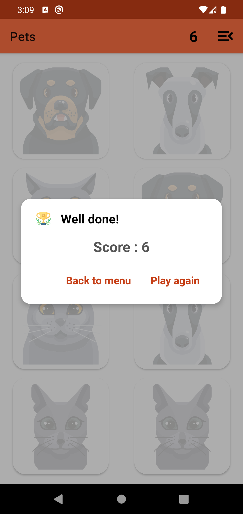

# Memory Cards Game 

Simple Memory Cards Game app using MVVM-Clean Architecture.

**App features:**
- Different level difficulties 
- Available remote (online) levels
## Tech stack

 - [Kotlin Coroutines & Flow](https://kotlinlang.org/api/kotlinx.coroutines/)
 - [Hilt](https://dagger.dev/hilt/) 
 - [Navigation Component + safeArgs](https://developer.android.com/guide/navigation/navigation-getting-started)
 - [Preferences DataStore](https://developer.android.com/topic/libraries/architecture/datastore)
 - [Glide](https://github.com/bumptech/glide)
 - [Cloud Firestore](https://firebase.google.com/docs/firestore)
 
## Screenshots
  
 
 

## Credits
- Icons from [www.flaticon.com](http://www.flaticon.com)